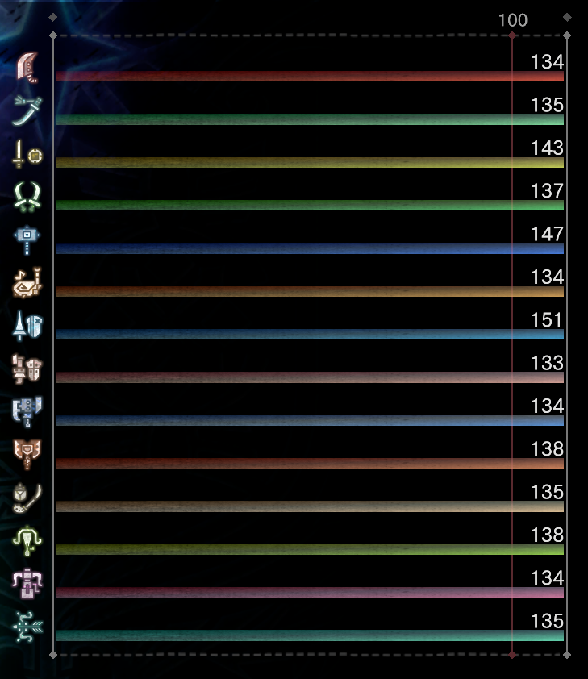
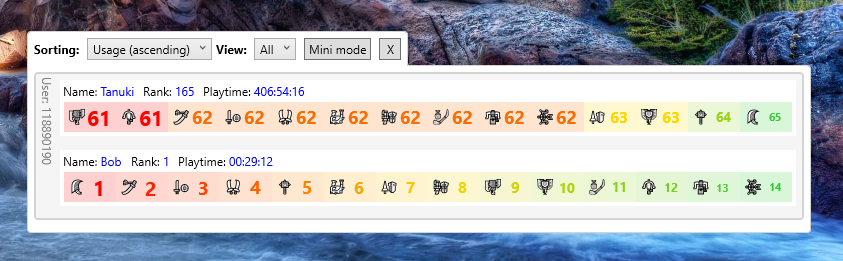
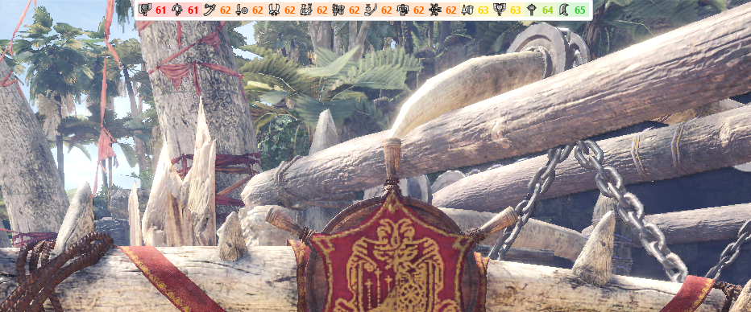

# Amendment of the license

DO NOT use this code, in part or in totality, to cheat, or produce code that would eventually lead to cheat.

# Overview

This application displays the current weapon usage, for Monster Hunter: World.

The display is based on your save files (all of them) and updated immediately when save change is detected.

For those like me who play with all weapons and want to always keep an eye on the weapon usage without always having to go to the guild card, this application is made for you.

Either you want to maintain the balance between weapons

or "max" a weapon and then move on to the next, it is always very useful to have that info available all the time. Unfortunately, the game does not provide such user interface, so consider it as an additional UI to solve that problem.

If you have two monitors, you can have the application beside the game.

If you have only one monitor (or if you have more than one but still don't like to have it aside) you can set it in mini-mode.

# Mini-mode

To enter mini-mode, simply right-click the application and click the `Toggle mini mode` context menu. Do the same to exit mini-mode.

When switching to mini-mode, the application prompts you for the save data slot to display. If you have only one, there is no prompt.

Also, in this mode, the application remain always on top of other windows, so you can have it as overlay within the game. Note that this works only with the game in windowed mode (probably), never tested in full-screen mode.

# Other features

The application supports multiple user accounts, and the 3 save slots per user account.

The save data is automatically reloaded and the UI is seamlessly updated, so after each auto-save, the application will keep the display up to date.

Color code shows the less used weapon in red, and the most used weapon in green, in gradient through yellow.

## Sorting

You can sort the weapon usage 3 different ways:
- `Tree`: Weapons are in the order you know, Great sword, Long sword, Sword and shield, etc...
- `Usage (ascending)`: Weapons are ordered from left to right, the less used to the most used
- `Usage (descending)`: Weapons are ordered from left to right, the most used to the less used

## View

The view selector let you choose if you want to see only `Low rank` weapon usage, `High rank`, `Investigations` or the total of all (`Total`). Just like in the game.

# Thanks

v00d00y, Asterisk
